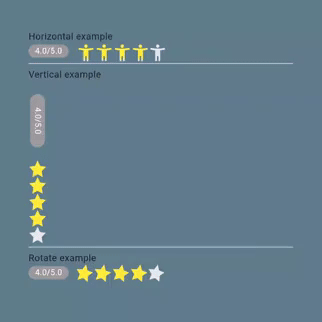

# Flutter Rating Stars

A Flutter package to create Rating Stars bar. It will be useful for your awesome app.



### Example

```dart
import 'package:flutter/material.dart';
import 'package:flutter_rating_stars/flutter_rating_stars.dart';

void main() => runApp(MyApp());

class MyApp extends StatefulWidget {
  @override
  _MyAppState createState() => _MyAppState();
}

class _MyAppState extends State<MyApp> {
  double value = 3.5;

  @override
  Widget build(BuildContext context) {
    return MaterialApp(
      title: 'Example',
      theme: ThemeData(
        primarySwatch: Colors.blue,
      ),
      home: Scaffold(
        appBar: AppBar(
          title: Text('Example'),
        ),
        body: Container(
          alignment: Alignment.center,
          color: Colors.blueGrey,
          padding: EdgeInsets.all(36),
          child: Column(
            crossAxisAlignment: CrossAxisAlignment.start,
            children: [
              Text('Horizontal example'),
              RatingStars(
                value: value,
                onValueChanged: (v) {
                  //
                  setState(() {
                    value = v;
                  });
                },
                starBuilder: (index, color) => Icon(
                  Icons.accessibility_new,
                  color: color,
                ),
                starCount: 5,
                starSize: 20,
                valueLabelColor: const Color(0xff9b9b9b),
                valueLabelTextStyle: const TextStyle(
                    color: Colors.white,
                    fontWeight: FontWeight.w400,
                    fontStyle: FontStyle.normal,
                    fontSize: 12.0),
                valueLabelRadius: 10,
                maxValue: 5,
                starSpacing: 2,
                maxValueVisibility: true,
                valueLabelVisibility: true,
                animationDuration: Duration(milliseconds: 1000),
                valueLabelPadding:
                const EdgeInsets.symmetric(vertical: 1, horizontal: 8),
                valueLabelMargin: const EdgeInsets.only(right: 8),
                starOffColor: const Color(0xffe7e8ea),
                starColor: Colors.yellow,
              ),
              const Divider(height: 10),
              Text('Vertical example'),
              Row(
                crossAxisAlignment: CrossAxisAlignment.start,
                children: [
                  RatingStars(
                    axis: Axis.vertical,
                    value: value,
                    onValueChanged: (v) {
                      //
                      setState(() {
                        value = v;
                      });
                    },
                    starCount: 5,
                    starSize: 20,
                    valueLabelColor: const Color(0xff9b9b9b),
                    valueLabelTextStyle: const TextStyle(
                        color: Colors.white,
                        fontWeight: FontWeight.w400,
                        fontStyle: FontStyle.normal,
                        fontSize: 12.0),
                    valueLabelRadius: 10,
                    maxValue: 5,
                    starSpacing: 2,
                    maxValueVisibility: true,
                    valueLabelVisibility: true,
                    animationDuration: Duration(milliseconds: 1000),
                    valueLabelPadding:
                    const EdgeInsets.symmetric(vertical: 1, horizontal: 8),
                    valueLabelMargin: const EdgeInsets.only(right: 8),
                    starOffColor: const Color(0xffe7e8ea),
                    starColor: Colors.yellow,
                  ),
                ],
              ),
              const Divider(height: 10),
              Text('Rotate example'),
              RatingStars(
                axis: Axis.horizontal,
                value: value,
                onValueChanged: (v) {
                  //
                  setState(() {
                    value = v;
                  });
                },
                starCount: 5,
                starSize: 20,
                valueLabelColor: const Color(0xff9b9b9b),
                valueLabelTextStyle: const TextStyle(
                    color: Colors.white,
                    fontWeight: FontWeight.w400,
                    fontStyle: FontStyle.normal,
                    fontSize: 12.0),
                valueLabelRadius: 10,
                maxValue: 5,
                starSpacing: 2,
                maxValueVisibility: true,
                valueLabelVisibility: true,
                animationDuration: Duration(milliseconds: 1000),
                valueLabelPadding:
                const EdgeInsets.symmetric(vertical: 1, horizontal: 8),
                valueLabelMargin: const EdgeInsets.only(right: 8),
                starOffColor: const Color(0xffe7e8ea),
                starColor: Colors.yellow,
                angle: 12,
              ),
            ],
          ),
        ),
      ),
    );
  }
}

```

### Development environment

```
[√] Flutter (Channel stable, 3.19.6, on Microsoft Windows [Version 10.0.19045.4291], locale en-US)
    • Flutter version 3.19.6 on channel stable at C:\Users\admin\fvm\default
    • Upstream repository https://github.com/flutter/flutter.git
    • Framework revision 54e66469a9 (2 days ago), 2024-04-17 13:08:03 -0700
    • Engine revision c4cd48e186
    • Dart version 3.3.4
    • DevTools version 2.31.1
```